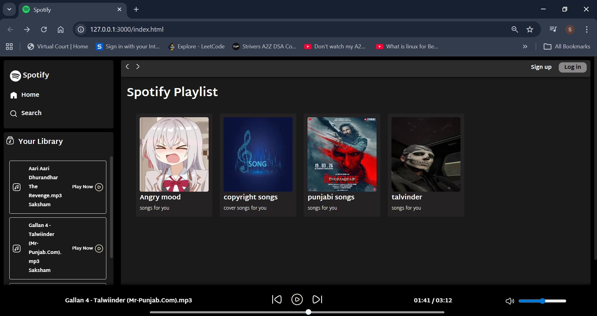

# 🎵 Music Web App (Spotify-Inspired)

A modern **music web application UI** built using **HTML, CSS, and JavaScript**, inspired by popular music streaming platforms like Spotify.

> ⚡ This project focuses on frontend development and interactive UI behavior.

---

## 🚀 Features

* 🎧 Play / Pause music
* ⏭️ Next / Previous track navigation
* 📊 Interactive seek bar
* 🔊 Volume control + mute toggle
* 📂 Dynamic song loading from folders
* 🎨 Clean and modern UI (music app inspired design)
* ⚡ Real-time duration tracking

---

## 🛠️ Tech Stack

* **HTML5**
* **CSS3**
* **JavaScript (Vanilla JS)**

---

## 📁 Project Structure

```
project/
│
├── index.html
├── style.css
├── script.js
├── assets/
│   ├── icons
│   └── images
│
└── songs/
    ├── folder1/
    │   ├── songs.mp3
    │   └── cover.jpg
    ├── folder2/
```

---

## 💡 How It Works

* Songs are dynamically loaded from folders
* JavaScript handles:

  * Audio playback
  * UI updates
  * Song switching
* The app simulates a real music streaming interface

---

## 📸 Preview

> 


```

```

---

## ⚠️ Note

* This is a **frontend-only project**
* No backend or database is used
* Folder-based song loading works best in a **local development environment**

---

## 🎯 Future Improvements

* 🔐 User authentication (Login / Signup)
* ☁️ Backend integration (Node.js)
* 🗄️ Database (MongoDB / PostgreSQL)
* 🎶 Playlists & favorites
* 🔍 Search functionality
* ⚛️ Convert to React

---

## 📌 Learning Outcomes

* DOM manipulation
* Event handling
* Audio API usage
* Async JavaScript (fetch, promises)
* UI/UX building

---

## 🧑‍💻 Author

**Saksham**

---

## ⭐ Acknowledgement

Inspired by modern music streaming platforms for learning and educational purposes.

---

## 📜 License

This project is for **educational use only**.
